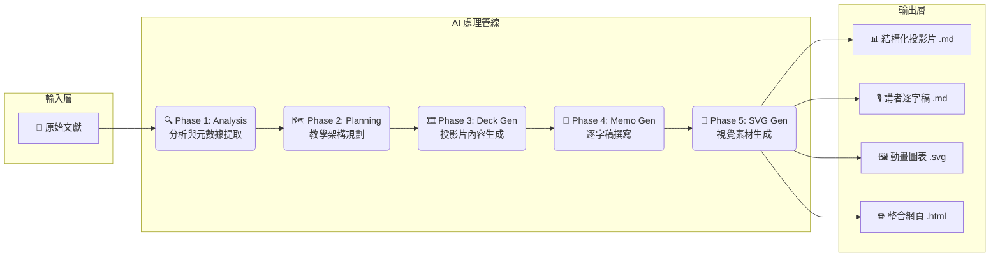
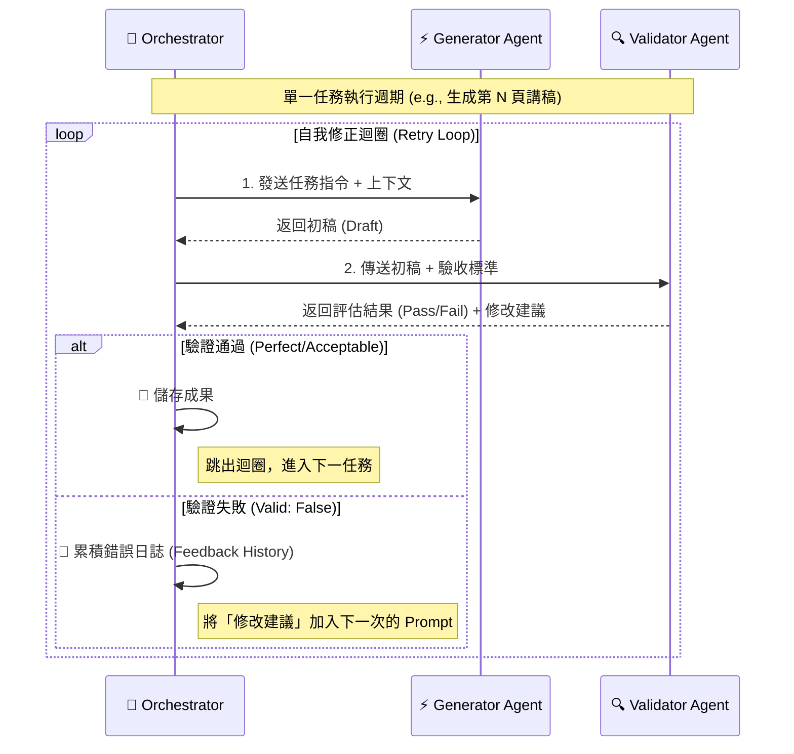

# 🧠 PPTPlaner (AI 簡報學習規劃器)

一個由 AI 驅動，專為「深度學習」而設計的簡報與講稿自動生成工具。

---

## 🎯 這是什麼？ (What It Does)

本專案的核心構想源於「費曼學習法」(The Feynman Technique) 
> — **如果你不能向其他人簡單解釋一件事，你就還沒有真正弄懂它。**

您是否曾為了準備一場簡報，而需要啃讀大量原文資料（如教科書、研究論文、商業報告），並為此耗費大量心力？

**PPTPlaner** 就是為了解決這個問題而生。它是一個以「教」為「學」的 AI 工具，能將任何長篇的原文文字，自動轉換成一套完整的簡報學習方案，包含：

1.  **重點投影片 (Slides)**：AI 會為您提煉原文精華，生成一頁頁重點清晰的 Markdown 格式投影片。
2.  **深度學習備忘稿 (Speaker Notes)**：這不只是一份講稿！AI 會扮演「老師」的角色，針對每一頁投影片的內容，從原文中找出更深入的細節、案例、上下文，並加上原文出處索引。這份備忘稿旨在幫助您在準備簡報的同時，真正地學懂、學透原文的核心知識。

### 核心使用情境

*   **從零到有**：提供一份原文書籍章節，AI 自動生成「投影片」與「深度學習備忘稿」。
*   **為簡報加值**：提供一份原文書籍章節，和一份您**已經做好**的簡報檔案，AI 會專注於為您現有的簡報，量身打造最匹配的深度學習備忘稿。

---

## ✨ 專案亮點 (Key Features)

*   🎓 **費曼學習法驅動 (Feynman-Powered Learning)**：
    * 本專案的核心是「以教為學」。AI 產出的備忘稿不只是講稿，更是實踐「費曼學習法」的工具。它將您置於老師的角色，引導您深入原文的精髓與案例，在準備「教」的過程中，達成真正的「懂」。
*   🤖 **AI 智慧分頁 (AI-Powered Planning)**：
    * 當給予一份現成的簡報檔案時，AI 會運用它的智慧去分析檔案的結構並規劃頁面，而非依賴固定的程式規則。
*   🎨 **客製化輸出 (Customizable Output)**：
    * UI 介面中提供一個「客製化需求」欄位，讓您可以直接用自然語言微調備忘稿的語氣、風格、語言或內容重點。
*   💻 **極簡易用 UI (User-Friendly UI)**：
    * 一個簡潔的圖形介面，讓您只需點幾下滑鼠，就能完成所有操作，完全無需撰寫任何程式碼。
*   📂 **自動化成果整理 (Organized Output)**：
    * 每一次執行，都會在 `output` 資料夾中，建立一個以「時間戳 + AI總結標題」命名的專屬資料夾，讓您的專案保持整潔、有條理。
*   🚀 **自動開啟成果 (Auto-Open Results)**：
    * 執行完畢後，程式會自動為您打開包含所有結果的資料夾，以及 `guide.html` 總覽頁面。
*   🛡️ **強韌執行機制 (Resilient Execution)**：
    *   遇到 API 配額耗盡或網絡錯誤時，系統不會崩潰，而是會自動暫停並保留進度。您可以隨時切換模型 (Model Switching) 或等待配額恢復後繼續執行，實現真正的「無限重試」。
*   🔍 **雙重 AI 品管循環 (Dual AI Quality Loops)**：為確保簡報與備忘稿的雙重品質，系統為兩者分別設計了「生成-品管-修正」的循環機制：
    1.  **簡報 (Slides)**：AI 會先**一次性生成整份簡報**，再由「設計總監 AI」從整體視角審核風格、語氣和邏輯流暢度。若不通過，整份簡報將被打回重做，確保了最終成品的高度一致性。
    2.  **備忘稿 (Memos)**：在簡報定稿後，針對每一頁投影片，系統採用「寫手-品管」兩階段流程，確保備忘稿的內容深度與準確性。

---

## 💻 系統預覽 (Demo)

<!-- 兩張圖並排，各佔一半（GitHub 允許的純 HTML，無 style 屬性） -->
<table width="100%">
  <tr>
    <td align="center"><b>程式運行畫面</b></td>
    <td align="center"><b>程式介面（含品管AI回饋）</b></td>
  </tr>
  <tr>
    <td width="50%" align="center">
      
    </td>
    <td width="50%" align="center">
      
    </td>
  </tr>
</table>

<!-- 跨欄：產出結果預覽 -->
<p align="center" style="margin-top: 12px;"><b>產出結果預覽</b></p>
<p align="center">
  
</p>

---

## ⚙️ 系統需求 (System Requirements)

### 手動安裝 (適用於非 Windows 或進階使用者)

如果您不是 Windows 使用者，或偏好手動設定環境，請依循以下步驟：

#### 步驟 1：安裝 Python

*   **用途**：這是執行本專案所有核心腳本的程式語言。
*   **如何安裝**：
    1.  前往 [Python 官方網站](https://www.python.org/downloads/) 下載最新版本。
    2.  執行安裝程式。在安裝的第一個畫面，**請務必勾選 `Add Python to PATH`** 這個選項，這非常重要！

#### 步驟 2：安裝 Node.js (包含 npm)

*   **用途**：我們需要它來安裝 AI 的核心命令列工具 (CLI)。
*   **如何安裝**：
    1.  前往 [Node.js 官方網站](https://nodejs.org/) 下載 `LTS` (長期支援) 版本。
    2.  執行安裝程式，一路點擊「下一步 (Next)」即可完成安裝。`npm` 會跟著一起被裝好。

#### 步驟 3：安裝 AI Agent (以 Gemini 為例)

*   **用途**：這是我們專案的「大腦」。
*   **如何安裝**：
    1.  打開您的「命令提示字元 (cmd.exe)」或「Windows Terminal」。
    2.  輸入並執行以下指令：
        ```bash
        npm install -g @google/gemini-cli@latest
        ```

完成以上三個步驟後，您的電腦就具備執行本專案所需的一切環境了！

---

## 🚀 如何執行 (Quick Start)

我們提供了一個「一鍵啟動」的體驗，讓任何人都能輕鬆使用。

1.  **找到 `START_HERE.bat`**
    *   在專案資料夾中，找到一個名為 `START_HERE.bat` 的檔案。

2.  **雙擊它**
    *   直接用滑鼠雙擊執行它。

3. 將你的原文書(僅接受: .txt, .md 格式)提供，即可開始生成簡報與備忘稿。
   * 如何將 PDF 轉換成 .md? 提供以下便利工具:
      * [MinerU 線上版](https://mineru.net/OpenSourceTools/Extractor) (開源 GitHub 位址: https://github.com/opendatalab/mineru)
      * (會使用 Docker + 有 GPU + 想本地運行的話可考慮) [DeepSeek-OCR-WebUI](https://github.com/neosun100/DeepSeek-OCR-WebUI)
      * (額外) 原本 PPT 的簡報若要轉換成 .md，建議先另存成 .pptx 格式，然後請 [ChatGPT](https://chatgpt.com/) 幫忙即可(但只是把文字提取出來而已，若想要更完整，還是建議用 MinerU 之類的工具)。

就是這麼簡單！這個腳本會自動處理所有事情，並為您啟動圖形操作介面。

---

## 🏗️ 技術架構 (Technical Architecture)

本專案採用 **階層式多代理人系統 (Hierarchical Multi-Agent System)** 架構，由一個中央指揮官 (`Orchestrator`) 協調多個專職的 AI Agent 進行協作。這種設計確保了長文本處理的穩定性，並透過「生成-審查」機制解決了 LLM 常見的幻覺問題。

### 1. 宏觀資料流 (Macro: The Data Pipeline)
系統將非結構化的原始文獻，透過五個階段的轉換，最終煉成結構化的知識資產。



### 2. 微觀協作模式 (Micro: The Agentic Loop)
為了確保產出品質，我們不依賴單次 Prompt (Zero-shot)，而是為每個關鍵步驟設計了 **"Generator-Validator-Refiner"** 的自我修正迴圈。

*   **Orchestrator (指揮官)**：負責狀態管理、錯誤處理與流程控制。
*   **Generator (生成者)**：專注於創造力與內容生成的 Agent。
*   **Validator (品管者)**：專注於邏輯檢查、事實查核與格式驗證的 Agent。



### 3. 核心技術亮點 (Technical Highlights)
*   **🛡️ 容錯式編排 (Fault-Tolerant Orchestration)**：
    *   實作了 **State Persistence (狀態持久化)**，即使 API 連線中斷或配額耗盡，系統能自動暫停並保存進度，隨時恢復執行 (Resume)。
*   **🧠 語境注入 (Context Injection)**：
    *   在生成下游內容（如 SVG 圖表）時，系統會自動注入上游的上下文（如投影片大綱、講稿內容），確保視覺圖表與演講內容高度一致。
*   **🔄 累積式反饋 (Cumulative Feedback)**：
    *   在重試迴圈中，系統會維護一份 `feedback_history`，讓 AI 不僅知道「這次錯了」，還知道「過去犯過哪些錯」，避免在修正過程中反覆踏入相同的誤區。
*   **👁️ 透明化品管 (Transparent QA & Audit Logs)**：
    *   系統會在 CLI 介面即時顯示每個階段的驗證結果與重試理由（例如：「內容遺漏」、「格式錯誤」）。
    *   同時，所有的 AI 推理過程（包含原始 Prompt、Raw Response、驗證回饋）都會完整記錄於 `logs/` 資料夾的日誌檔中，提供完整的 **可追溯性 (Traceability)**，讓您隨時可以「查帳」AI 的思考邏輯。

---

## 📂 核心檔案清單 (Core Project Files)

若您想分享此專案，以下是確保程式運作所需的最精簡檔案列表：

```
PPTPlaner/
├─ START_HERE.bat         # ⭐ 使用者唯一的啟動入口
├─ AGENTS.md              # AI 指令書 (不可或缺)
├─ config.yaml            # 專案基礎設定
├─ requirements.txt       # Python 套件依賴列表
├─ run_ui.py              # 圖形介面主程式
├─ templates/
│  └─ guide.html.j2     # HTML 產生模板
└─ scripts/
   ├─ orchestrate.py      # 核心主控腳本
   └─ build_guide.py      # HTML 產生腳本
```

**您需要提供的：**
*   您自己的原文書或簡報檔案，通常會放在 `source/` 資料夾中。

---

## 💡 專案初衷：The "Why" Behind PPTPlaner

> **「程式碼不僅是邏輯的堆疊，更是我們對抗資訊焦慮、守護時間的武器。」**
> *Code is not just logic; it is our weapon against the anxiety of time.*

### 1. 緣起：在案件與文獻的夾縫中求生
身處 2025 年的科技偵查、資料分析、AI 研究與開源情資（OSINT）第一線，我們最稀缺的資源永遠是 **「時間」** 。面對日新月異的 ArXiv 論文、突發的技術報告，以及海量的白皮書，我們常陷入「讀與不讀」的兩難。

**PPTPlaner** 誕生於這種生存壓力之下。我們不希望技術學習成為負擔，它應該是**自動、高效且結構化**的。

### 2. 開發哲學：不完美的橋樑，通往完美的知識
我們必須誠實且謙卑地說明：**我們不生產知識，我們致力於成為原著與讀者之間的「橋樑」。**

*   **推崇原著**：PPTPlaner 的產出絕非原著的替代品。我們希望幫助您用 10 分鐘判斷這篇文獻是否值得您花 3 小時深讀。**回到原著，才是獲取真實價值的途徑。**
*   **引用倫理 (Citation Ethics)**：本工具的 Prompt 已被精心設計為「知識導讀者」而非「創作者」。生成的內容會盡力保持客觀並標註來源，但作為使用者，**您有責任確認最終產出的引用是否準確**，並尊重原作者的智慧財產權。
*   **擁抱進化**：這是一個基於 Google Apps Script、Gemini API 等工具構建的開源專案。如果您覺得生成的內容有瑕疵，感謝您幫我們找出了盲點；如果您有更好的 Prompt 或架構建議，**歡迎發起 Issue 或 PR**。

### 3. 願景：保持尖端戰力的浪漫
正如作者在 DeepRead AI 頻道創立時所言：

> 「希望這個小作品，能在大家忙碌的工作裡，放進一點輕鬆、也放進一點**『保持尖端戰力』的浪漫**。」

無論您是執法夥伴、資安專家還是開發者，歡迎 Fork 這個專案，打造屬於您的知識萃取流水線。讓我們不用再孤軍奮戰，用最省力的方式，一起變強。

---

### 🔗 相關連結 (Links)
* **🏭 核心工具 (This Repo):** [PPTPlaner GitHub](https://github.com/Chiakai-Chang/PPTPlaner)
* **📚 內容展示 (Website):** [DeepRead AI Tech Feed](https://aideepread-tech.github.io/)
* **📺 影片導讀 (YouTube):** [DeepRead AI Channel](https://www.youtube.com/@DeepReadAI-CK)

---

## 📜 授權與作者 (License & Credits)

*   **License**: MIT License. 可自由使用於非商業的教學與研究用途。
*   **Original Creator**: Chiakai Chang
*   **Contact**:
    *   **Email**: [lotifv@gmail.com](mailto:lotifv@gmail.com)
    *   **LinkedIn**: [chiakai-chang-htciu](https://www.linkedin.com/in/chiakai-chang-htciu)
    *   **GitHub**: [Chiakai-Chang](https://github.com/Chiakai-Chang)
*   **Inspiration**: Inspired by the need to prepare for the *Eyewitness Memory* chapter in a Forensic Psychology course at Central Police University.
