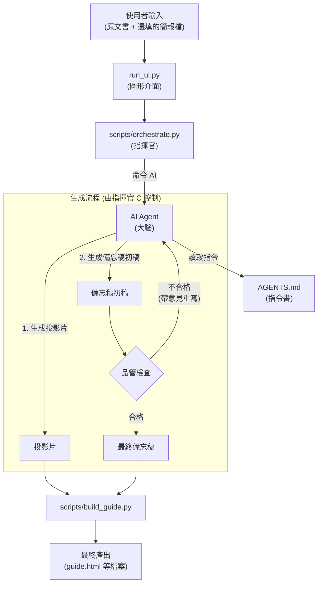

# 🧠 PPTPlaner (AI 簡報學習規劃器)

一個由 AI 驅動，專為「深度學習」而設計的簡報與講稿自動生成工具。

---

## 🎯 這是什麼？ (What It Does)

您是否曾為了準備一場簡報，而需要啃讀大量原文資料（如教科書、研究論文、商業報告），並為此耗費大量心力？

**PPTPlaner** 就是為了解決這個問題而生。它是一個 AI 工具，能將任何長篇的原文文字，自動轉換成一套完整的簡報學習方案，包含：

1.  **重點投影片 (Slides)**：AI 會為您提煉原文精華，生成一頁頁重點清晰的 Markdown 格式投影片。
2.  **深度學習備忘稿 (Speaker Notes)**：這不只是一份講稿！AI 會扮演「老師」的角色，針對每一頁投影片的內容，從原文中找出更深入的細節、案例、上下文，並加上原文出處索引。這份備忘稿旨在幫助您在準備簡報的同時，真正地學懂、學透原文的核心知識。

### 核心使用情境

*   **從零到有**：提供一份原文書籍章節，AI 自動生成「投影片」與「深度學習備忘稿」。
*   **為簡報加值**：提供一份原文書籍章節，和一份您**已經做好**的簡報檔案，AI 會專注於為您現有的簡報，量身打造最匹配的深度學習備忘稿。

---

## ✨ 專案亮點 (Key Features)

*   🎓 **為學習而生的備忘稿 (Memos for Learning)**：AI 的目標是「教會你」，而不只是「總結」。它產出的備忘稿，旨在引導講者深入學習原文書的精髓、案例與脈絡，真正實現「以教為學」。
*   🤖 **AI 智慧分頁 (AI-Powered Planning)**：當給予一份現成的簡報檔案時，AI 會運用它的智慧去分析檔案的結構並規劃頁面，而非依賴固定的程式規則。
*   🎨 **客製化輸出 (Customizable Output)**：UI 介面中提供一個「客製化需求」欄位，讓您可以直接用自然語言微調備忘稿的語氣、風格、語言或內容重點。
*   💻 **極簡易用 UI (User-Friendly UI)**：一個簡潔的圖形介面，讓您只需點幾下滑鼠，就能完成所有操作，完全無需撰寫任何程式碼。
*   📂 **自動化成果整理 (Organized Output)**：每一次執行，都會在 `output` 資料夾中，建立一個以「時間戳 + AI總結標題」命名的專屬資料夾，讓您的專案保持整潔、有條理。
*   🚀 **自動開啟成果 (Auto-Open Results)**：執行完畢後，程式會自動為您打開包含所有結果的資料夾，以及 `guide.html` 總覽頁面。
*   🔍 **AI 自我校驗與修正 (AI Self-Validation & Rework)**：為確保備忘稿的品質，系統採用「寫手-品管」兩階段 AI 流程。在「寫手 AI」生成內容後，會由「品管 AI」進行校驗。若未通過，品管員的回饋意見將被用來指導寫手 AI 進行重寫與修正，確保最終產出的內容連貫、準確且高品質。

---

## 💻 系統預覽 (Demo)

<!-- 兩張圖並排，各佔一半（GitHub 允許的純 HTML，無 style 屬性） -->
<table width="100%">
  <tr>
    <td align="center"><b>程式運行畫面</b></td>
    <td align="center"><b>程式介面（含品管AI回饋）</b></td>
  </tr>
  <tr>
    <td width="50%" align="center">
      
    </td>
    <td width="50%" align="center">
      
    </td>
  </tr>
</table>

<!-- 跨欄：產出結果預覽 -->
<p align="center" style="margin-top: 12px;"><b>產出結果預覽</b></p>
<p align="center">
  
</p>

---

## ⚙️ 系統需求 (System Requirements)

為了讓程式順利運行，您的電腦需要先安裝兩項基礎軟體。別擔心，整個過程非常簡單！

### 步驟 1：安裝 Python

*   **用途**：這是執行本專案所有核心腳本的程式語言。
*   **如何安裝**：
    1.  前往 [Python 官方網站](https://www.python.org/downloads/) 下載最新版本。
    2.  執行安裝程式。在安裝的第一個畫面，**請務必勾選 `Add Python to PATH`** 這個選項，這非常重要！

### 步驟 2：安裝 Node.js (包含 npm)

*   **用途**：我們需要它來安裝 AI 的核心命令列工具 (CLI)。
*   **如何安裝**：
    1.  前往 [Node.js 官方網站](https://nodejs.org/) 下載 `LTS` (長期支援) 版本。
    2.  執行安裝程式，一路點擊「下一步 (Next)」即可完成安裝。`npm` 會跟著一起被裝好。

### 步驟 3：安裝 AI Agent (以 Gemini 為例)

*   **用途**：這是我們專案的「大腦」。
*   **如何安裝**：
    1.  打開您的「命令提示字元 (cmd.exe)」或「Windows Terminal」。
    2.  輸入並執行以下指令：
        ```bash
        npm install -g @google/gemini-cli@latest
        ```

完成以上三個步驟後，您的電腦就具備執行本專案所需的一切環境了！

---

## 🚀 如何執行 (Quick Start)

我們提供了一個「一鍵啟動」的體驗，讓任何人都能輕鬆使用。

1.  **找到 `START_HERE.bat`**
    *   在專案資料夾中，找到一個名為 `START_HERE.bat` 的檔案。

2.  **雙擊它**
    *   直接用滑鼠雙擊執行它。

就是這麼簡單！這個腳本會自動處理所有事情，並為您啟動圖形操作介面。

---

## 🧭 運作原理 (How It Works)

本系統的核心設計是將「指揮官」、「大腦」、「指令書」三個角色分離，實現自動化且高品質的內容生成。

*   **指揮官 (The Commander) - `scripts/orchestrate.py`**
    *   這個 Python 腳本是整個流程的自動化指揮官。它負責讀取設定、依序呼叫 AI、並將結果存檔。它**不負責**任何內容的理解與創作。

*   **大腦 (The Brain) - AI Agent (e.g., Gemini CLI)**
    *   您所選擇的 AI Agent 是真正的核心大腦。它負責讀取您的原始文本，並根據指令書的規則，進行規劃、摘要、創作簡報與備忘稿。

*   **指令書 (The Instruction Manual) - `AGENTS.md`**
    *   這份規格文件是您給予 AI 的劇本與指令。AI 的所有產出品質、風格、格式，都取決於這份指令書的定義。

> 下圖展示了「指揮官」如何驅動「大腦」依據「指令書」完成任務的流程：



### 備忘稿的「品管-修正」循環 (The Memo Quality-Rework Loop)

本專案最特殊之處，在於生成備忘稿時的「自我修正」機制，以確保高品質輸出：

1.  **生成初稿 (Drafting)**：指揮官 (`orchestrate.py`) 命令「寫手 AI」(`MEMO` agent) 根據投影片和原文，生成第一版備忘稿。
2.  **品質檢驗 (Validation)**：指揮官接著將初稿交給「品管 AI」(`VALIDATE_MEMO` agent)。品管員會檢查稿件是否緊扣投影片主題、是否提供足夠的深度與細節。
3.  **迭代修正 (Reworking)**：
    *   若品管員判定**合格**，則此備忘稿被採納。
    *   若品管員判定**不合格**，它會提供具體的修改建議 (`feedback`)。指揮官會帶著這些建議，再次命令「寫手 AI」重寫一份。

這個「生成 -> 品管 -> 修正 -> 再品管」的循環最多會進行 2 次，大幅提升了最終備忘稿的準確性與實用性。

---

## 📂 核心檔案清單 (Core Project Files)

若您想分享此專案，以下是確保程式運作所需的最精簡檔案列表：

```
PPTPlaner/
├─ START_HERE.bat         # ⭐ 使用者唯一的啟動入口
├─ AGENTS.md              # AI 指令書 (不可或缺)
├─ config.yaml            # 專案基礎設定
├─ requirements.txt       # Python 套件依賴列表
├─ run_ui.py              # 圖形介面主程式
├─ templates/
│  └─ guide.html.j2     # HTML 產生模板
└─ scripts/
   ├─ orchestrate.py      # 核心主控腳本
   └─ build_guide.py      # HTML 產生腳本
```

**您需要提供的：**
*   您自己的原文書或簡報檔案，通常會放在 `source/` 資料夾中。

---

## 📜 授權與作者 (License & Credits)

*   **License**: MIT License. 可自由使用於非商業的教學與研究用途。
*   **Original Creator**: Chiakai Chang
*   **Contact**:
    *   **Email**: [lotifv@gmail.com](mailto:lotifv@gmail.com)
    *   **LinkedIn**: [chiakai-chang-htciu](https://www.linkedin.com/in/chiakai-chang-htciu)
    *   **GitHub**: [Chiakai-Chang](https://github.com/Chiakai-Chang)
*   **Inspiration**: Inspired by the need to prepare for the *Eyewitness Memory* chapter in a Forensic Psychology course at Central Police University.
