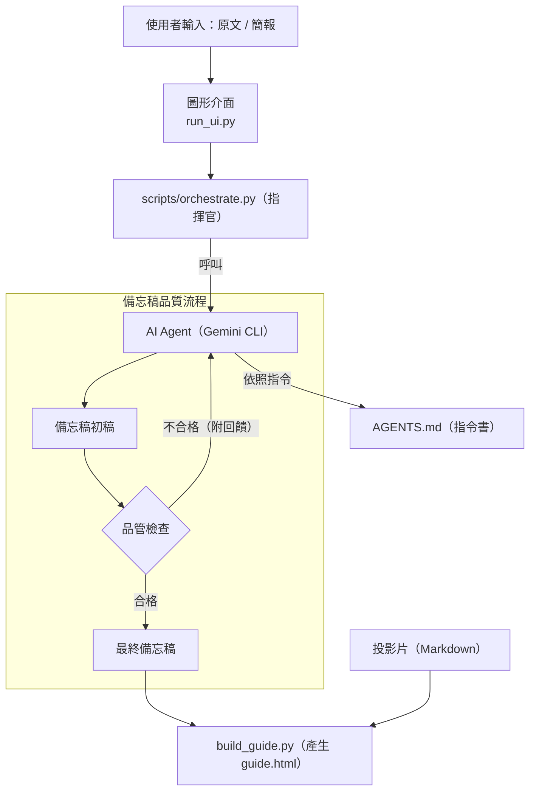

# 🧠 PPTPlaner — AI 簡報學習規劃器

> 把厚厚的書，變成會教你的簡報。
> 學得更快，也真的學會。

---

## 📌 這是什麼？（What It Does）

當你需要準備一份**深度內容的簡報**（教科書、研究論文、政策白皮書、商業報告…）時，你可能會：

* 花很多時間「讀原文 → 摘要 → 排版 → 寫講稿」
* 但依然覺得理解不夠深入，講解不夠精準

**PPTPlaner** 就是為了解決這個痛點而設計。

給它**一份原文內容**，它會自動為你生成：

1. **重點投影片 (Slides, Markdown 版)**
2. **深度學習備忘稿 (Speaker Notes)**

其中，備忘稿不是普通講稿，而是 **「以教為學」風格** ——
它會帶你真正理解概念、脈絡、案例、研究結果與推論。

---

## 🎯 使用情境

| 使用情境              | 說明                                      |
| ----------------- | --------------------------------------- |
| **從零開始做簡報**       | 上傳書籍章節，AI 直接生出投影片 + 備忘稿                 |
| **已有簡報，想加深內容**    | 上傳你現有的簡報（PDF/PPTX），AI 專注幫你做「補充 + 教學式說明」 |
| **考試 / 授課 / 讀書會** | 快速掌握重點，避免只會念、不會講                        |

---

## ✨ 專案亮點（Key Features）

| 亮點               | 說明                                 |
| ---------------- | ---------------------------------- |
| 🎓 **為學習而生的備忘稿** | AI 扮演「老師」，不是「壓縮器」。重點是教會你。          |
| 🤖 **AI 智慧分頁**   | 非單純切分，而是理解內容後重新規劃。                 |
| 🎨 **可調整風格**     | UI 中可輸入自然語言指定語氣、深度、口語/嚴謹程度。        |
| 🔍 **品管-迭代流程**   | 備忘稿會自動經過「寫手 AI → 品管 AI → 重寫」確保品質。  |
| 📂 **輸出自動管理**    | 每次執行產生一個完整報告資料夾 + guide.html 導覽頁。  |
| 🚀 **只要雙擊就能用**   | 所有流程由 `START_HERE.bat` 啟動。無須命令列經驗。 |

---

## 🖥️ 系統預覽（Demo）

<table width="100%">
  <tr>
    <td align="center"><b>程式運行畫面</b></td>
    <td align="center"><b>程式介面（含品管 AI 回饋）</b></td>
  </tr>
  <tr>
    <td width="50%" align="center"></td>
    <td width="50%" align="center"></td>
  </tr>
</table>

<p align="center"><b>產出結果預覽</b></p>
<p align="center"></p>

---

## 📦 取得專案（Download Project）

如果你會用 Git：

```bash
git clone https://github.com/Chiakai-Chang/PPTPlaner.git
cd PPTPlaner
```

如果你不會用 Git →
點右上角 **Code → Download ZIP → 解壓縮** 即可。

---

## ⚙️ 系統需求（System Requirements）

| 軟體                | 用途         | 下載位置                                                                   |
| ----------------- | ---------- | ---------------------------------------------------------------------- |
| **Python**        | 執行主程式      | [https://www.python.org/downloads/](https://www.python.org/downloads/) |
| **Node.js + npm** | 安裝 AI 指令工具 | [https://nodejs.org/](https://nodejs.org/)                             |
| **Gemini CLI**    | AI 「大腦」    | `npm install -g @google/gemini-cli@latest`                             |

> ⚠️ 安裝 Python 時請務必勾選 `Add Python to PATH`

---

## 🚀 快速開始（Quick Start）

1. 下載並進入專案資料夾
2. **雙擊 `START_HERE.bat`**

就這樣。
介面會自動開啟，你可以直接開始操作。🎉

---

## 🧭 運作原理（How It Works）



---

## 📂 專案結構（Core Files）

```
PPTPlaner/
├─ START_HERE.bat         # ⭐ 一鍵啟動
├─ run_ui.py              # GUI 主程式
├─ AGENTS.md              # AI 指令書（靈魂）
├─ config.yaml            # 設定檔
├─ requirements.txt       # Python 依賴
├─ templates/
│  └─ guide.html.j2       # 結果頁模板
└─ scripts/
   ├─ orchestrate.py      # 自動化主控
   └─ build_guide.py      # 結果產出
```

**你要準備的只有：**
放入你的書 / 論文 / 簡報 → 交給程式

---

## 📜 授權 & 作者（License & Credits）

| 項目          | 內容                                                                                                 |
| ----------- | -------------------------------------------------------------------------------------------------- |
| License     | MIT License                                                                                        |
| 作者          | **Chiakai Chang**                                                                                  |
| Email       | [lotifv@gmail.com](mailto:lotifv@gmail.com)                                                        |
| LinkedIn    | [https://www.linkedin.com/in/chiakai-chang-htciu](https://www.linkedin.com/in/chiakai-chang-htciu) |
| GitHub      | [https://github.com/Chiakai-Chang](https://github.com/Chiakai-Chang)                               |
| Inspiration | 為中央警察大學博士班法與心理學課程準備備忘稿時誕生                                                              |

---
