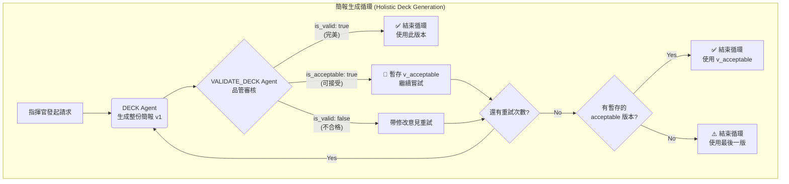
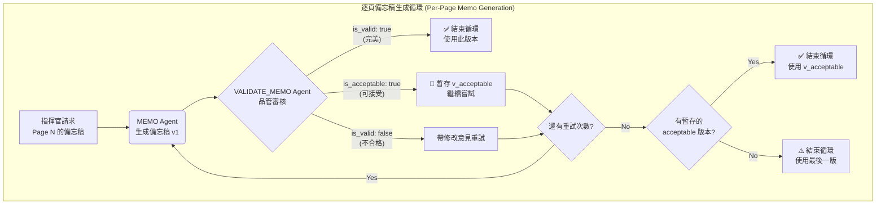

# 🧠 PPTPlaner (AI 簡報學習規劃器)

一個由 AI 驅動，專為「深度學習」而設計的簡報與講稿自動生成工具。

---

## 🎯 這是什麼？ (What It Does)

本專案的核心構想源於「費曼學習法」(The Feynman Technique) 
> — **如果你不能向其他人簡單解釋一件事，你就還沒有真正弄懂它。**

您是否曾為了準備一場簡報，而需要啃讀大量原文資料（如教科書、研究論文、商業報告），並為此耗費大量心力？

**PPTPlaner** 就是為了解決這個問題而生。它是一個以「教」為「學」的 AI 工具，能將任何長篇的原文文字，自動轉換成一套完整的簡報學習方案，包含：

1.  **重點投影片 (Slides)**：AI 會為您提煉原文精華，生成一頁頁重點清晰的 Markdown 格式投影片。
2.  **深度學習備忘稿 (Speaker Notes)**：這不只是一份講稿！AI 會扮演「老師」的角色，針對每一頁投影片的內容，從原文中找出更深入的細節、案例、上下文，並加上原文出處索引。這份備忘稿旨在幫助您在準備簡報的同時，真正地學懂、學透原文的核心知識。

### 核心使用情境

*   **從零到有**：提供一份原文書籍章節，AI 自動生成「投影片」與「深度學習備忘稿」。
*   **為簡報加值**：提供一份原文書籍章節，和一份您**已經做好**的簡報檔案，AI 會專注於為您現有的簡報，量身打造最匹配的深度學習備忘稿。

---

## ✨ 專案亮點 (Key Features)

*   🎓 **費曼學習法驅動 (Feynman-Powered Learning)**：
    * 本專案的核心是「以教為學」。AI 產出的備忘稿不只是講稿，更是實踐「費曼學習法」的工具。它將您置於老師的角色，引導您深入原文的精髓與案例，在準備「教」的過程中，達成真正的「懂」。
*   🤖 **AI 智慧分頁 (AI-Powered Planning)**：
    * 當給予一份現成的簡報檔案時，AI 會運用它的智慧去分析檔案的結構並規劃頁面，而非依賴固定的程式規則。
*   🎨 **客製化輸出 (Customizable Output)**：
    * UI 介面中提供一個「客製化需求」欄位，讓您可以直接用自然語言微調備忘稿的語氣、風格、語言或內容重點。
*   💻 **極簡易用 UI (User-Friendly UI)**：
    * 一個簡潔的圖形介面，讓您只需點幾下滑鼠，就能完成所有操作，完全無需撰寫任何程式碼。
*   📂 **自動化成果整理 (Organized Output)**：
    * 每一次執行，都會在 `output` 資料夾中，建立一個以「時間戳 + AI總結標題」命名的專屬資料夾，讓您的專案保持整潔、有條理。
*   🚀 **自動開啟成果 (Auto-Open Results)**：
    * 執行完畢後，程式會自動為您打開包含所有結果的資料夾，以及 `guide.html` 總覽頁面。
*   🔍 **雙重 AI 品管循環 (Dual AI Quality Loops)**：為確保簡報與備忘稿的雙重品質，系統為兩者分別設計了「生成-品管-修正」的循環機制：
    1.  **簡報 (Slides)**：AI 會先**一次性生成整份簡報**，再由「設計總監 AI」從整體視角審核風格、語氣和邏輯流暢度。若不通過，整份簡報將被打回重做，確保了最終成品的高度一致性。
    2.  **備忘稿 (Memos)**：在簡報定稿後，針對每一頁投影片，系統採用「寫手-品管」兩階段流程，確保備忘稿的內容深度與準確性。

---

## 💻 系統預覽 (Demo)

<!-- 兩張圖並排，各佔一半（GitHub 允許的純 HTML，無 style 屬性） -->
<table width="100%">
  <tr>
    <td align="center"><b>程式運行畫面</b></td>
    <td align="center"><b>程式介面（含品管AI回饋）</b></td>
  </tr>
  <tr>
    <td width="50%" align="center">
      
    </td>
    <td width="50%" align="center">
      
    </td>
  </tr>
</table>

<!-- 跨欄：產出結果預覽 -->
<p align="center" style="margin-top: 12px;"><b>產出結果預覽</b></p>
<p align="center">
  
</p>

---

## ⚙️ 系統需求 (System Requirements)

### 懶人福音：Windows 環境一鍵安裝

為了讓 Windows 使用者免於繁瑣的環境設定，作者特別開發了一款「[一鍵自動安裝腳本](https://github.com/Chiakai-Chang/Gemini-CLI-Windows-Auto-Installer)」。

**強烈建議 Windows 使用者使用此腳本**，它會為您自動處理好 `Python`, `Node.js`, 以及 `Gemini CLI` 的所有安裝與設定。您只需：
1.  前往 [Gemini CLI Windows Auto-Installer](https://github.com/Chiakai-Chang/Gemini-CLI-Windows-Auto-Installer) 專案頁面。
2.  依照其 `README.md` 檔案中的「如何使用」說明，下載並以系統管理員身分執行 `install.bat` 即可。

---

### 手動安裝 (適用於非 Windows 或進階使用者)

如果您不是 Windows 使用者，或偏好手動設定環境，請依循以下步驟：

#### 步驟 1：安裝 Python

*   **用途**：這是執行本專案所有核心腳本的程式語言。
*   **如何安裝**：
    1.  前往 [Python 官方網站](https://www.python.org/downloads/) 下載最新版本。
    2.  執行安裝程式。在安裝的第一個畫面，**請務必勾選 `Add Python to PATH`** 這個選項，這非常重要！

#### 步驟 2：安裝 Node.js (包含 npm)

*   **用途**：我們需要它來安裝 AI 的核心命令列工具 (CLI)。
*   **如何安裝**：
    1.  前往 [Node.js 官方網站](https://nodejs.org/) 下載 `LTS` (長期支援) 版本。
    2.  執行安裝程式，一路點擊「下一步 (Next)」即可完成安裝。`npm` 會跟著一起被裝好。

#### 步驟 3：安裝 AI Agent (以 Gemini 為例)

*   **用途**：這是我們專案的「大腦」。
*   **如何安裝**：
    1.  打開您的「命令提示字元 (cmd.exe)」或「Windows Terminal」。
    2.  輸入並執行以下指令：
        ```bash
        npm install -g @google/gemini-cli@latest
        ```

完成以上三個步驟後，您的電腦就具備執行本專案所需的一切環境了！

---

## 🚀 如何執行 (Quick Start)

我們提供了一個「一鍵啟動」的體驗，讓任何人都能輕鬆使用。

1.  **找到 `START_HERE.bat`**
    *   在專案資料夾中，找到一個名為 `START_HERE.bat` 的檔案。

2.  **雙擊它**
    *   直接用滑鼠雙擊執行它。

3. 將你的原文書(僅接受: .txt, .md 格式)提供，即可開始生成簡報與備忘稿。
   * 如何將 PDF 轉換成 .md? 提供以下便利工具:
      * [MinerU 線上版](https://mineru.net/OpenSourceTools/Extractor) (開源 GitHub 位址: https://github.com/opendatalab/mineru)
      * 原本 PPT 的簡報若要轉換成 .md，建議先另存成 .pptx 格式，然後請 [ChatGPT](https://chatgpt.com/) 幫忙即可。

就是這麼簡單！這個腳本會自動處理所有事情，並為您啟動圖形操作介面。

---

## 🧭 運作原理 (How It Works)

本系統的核心設計是將「指揮官」、「大腦 (AI Agent 團隊)」、「指令書」三個角色分離，實現一個分工清晰、高度自動化的內容生成流程。

*   **指揮官 (The Commander) - `scripts/orchestrate.py`**
    *   這個 Python 腳本是整個流程的自動化指揮官。它負責讀取設定、依序呼叫 AI 團隊、管理品管流程、並將最終結果存檔。它**不負責**任何內容的理解與創作，只專注於流程控制。

*   **大腦 (The Brain) - AI Agent 團隊**
    *   您所選擇的 AI 是真正的核心大腦，但它並非單一個體，而是一個各司其職的專家團隊。團隊中的每一位 Agent 都有獨特的角色和任務。

*   **指令書 (The Instruction Manual) - `AGENTS.md`**
    *   這份規格文件是您給予 AI 團隊的劇本與指令。每一位 Agent 的角色、個性、產出格式與工作要求，都由這份文件精準定義。可以說，**`AGENTS.md` 的內容，決定了整個專案的產出品質與靈魂**。

### AI 團隊成員 (The Team of AI Agents)

| Agent (角色)         | 任務 (Task)                                                                                             | 說明                                                               |
| -------------------- | ------------------------------------------------------------------------------------------------------- | ------------------------------------------------------------------ |
| `SUMMARIZE_TITLE`    | **檔案管理員**                                                                                          | 讀取來源文件，為這次的執行任務取一個簡潔、適合當作資料夾名稱的標題。 |
| `PLAN`               | **內容架構師**                                                                                          | 深入分析來源文件，規劃出整份簡報的大綱與頁面結構 (topics)。          |
| `DECK`               | **創意總監**                                                                                            | 根據 `PLAN` 的大綱，一次性生成**整份**簡報的初稿，確保風格與調性一致。 |
| `VALIDATE_DECK`      | **總編輯**                                                                                              | 從宏觀角度審核整份簡報，檢查風格、邏輯流暢度與頁面間的連貫性。       |
| `MEMO`               | **主題專家 / 資深寫手**                                                                                 | 針對**單一頁**投影片，從原始文件中挖掘深度資訊，撰寫詳細的備忘稿。     |
| `VALIDATE_MEMO`      | **事實查核員 / 品管**                                                                                   | 仔細比對**單一頁**的備忘稿與其對應的投影片，確保內容準確、無遺漏。   |

---

## 🏆 追求卓越：雙重 AI 品管引擎 (The Dual AI Quality Engine)

本專案最特殊之處，在於其追求卓越的雙重「自我修正」機制。我們不滿足於「堪用」的成果，而是為簡報與備忘稿分別設計了**以「完美」為目標、以「可接受」為底線**的智慧品管循環。

此機制的核心，是品管 Agent (`VALIDATE_DECK` 和 `VALIDATE_MEMO`) 的三種回饋：
1.  **`is_valid: true` (完美)**：產出完全符合所有要求，品質無懈可擊。品管循環**立即結束**，採用此版本。
2.  **`is_acceptable: true` (可接受)**：產出符合核心要求，但有微小瑕疵。系統會**暫存此版本作為備案**，並**繼續嘗試**在剩餘的重試次數內追求完美。
3.  **`is_valid: false` (不合格)**：產出有重大缺失，無法接受。系統會根據品管員提供的修改意見，立即重做。

這個機制讓 AI 能在設定的重試次數 (`slide_max_reworks` / `memo_max_reworks` in `config.yaml`) 內，不斷自我挑戰，以交付最優質的成果。

### 1. 簡報生成循環 (Holistic Deck Generation)

為確保風格與邏輯的高度一致性，簡報採用「全體生成、整體審核」的模式。



### 2. 逐頁備忘稿生成循環 (Per-Page Memo Generation)

在簡報定稿後，系統會針對**每一頁**投影片，獨立運行以下的品管循環，以確保備忘稿的細節與深度。


這個「生成 -> 品管 -> 修正」的雙重智慧循環，是本專案能夠產出高品質成果的核心關鍵。

---

## 📂 核心檔案清單 (Core Project Files)

若您想分享此專案，以下是確保程式運作所需的最精簡檔案列表：

```
PPTPlaner/
├─ START_HERE.bat         # ⭐ 使用者唯一的啟動入口
├─ AGENTS.md              # AI 指令書 (不可或缺)
├─ config.yaml            # 專案基礎設定
├─ requirements.txt       # Python 套件依賴列表
├─ run_ui.py              # 圖形介面主程式
├─ templates/
│  └─ guide.html.j2     # HTML 產生模板
└─ scripts/
   ├─ orchestrate.py      # 核心主控腳本
   └─ build_guide.py      # HTML 產生腳本
```

**您需要提供的：**
*   您自己的原文書或簡報檔案，通常會放在 `source/` 資料夾中。

---

## 📜 授權與作者 (License & Credits)

*   **License**: MIT License. 可自由使用於非商業的教學與研究用途。
*   **Original Creator**: Chiakai Chang
*   **Contact**:
    *   **Email**: [lotifv@gmail.com](mailto:lotifv@gmail.com)
    *   **LinkedIn**: [chiakai-chang-htciu](https://www.linkedin.com/in/chiakai-chang-htciu)
    *   **GitHub**: [Chiakai-Chang](https://github.com/Chiakai-Chang)
*   **Inspiration**: Inspired by the need to prepare for the *Eyewitness Memory* chapter in a Forensic Psychology course at Central Police University.
