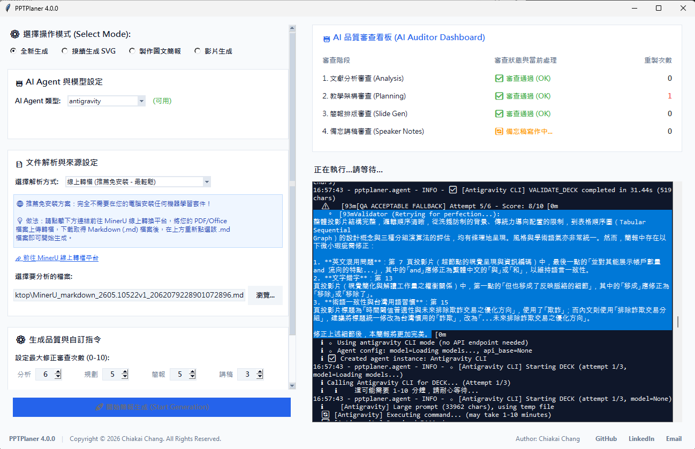
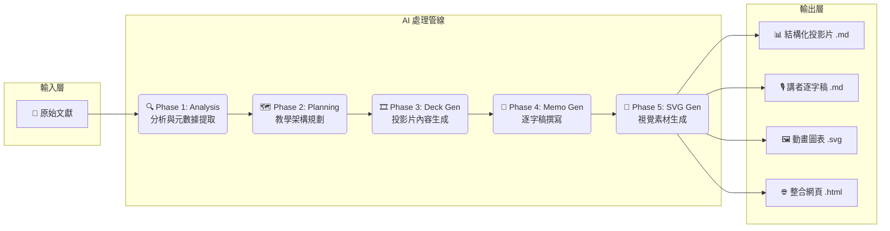
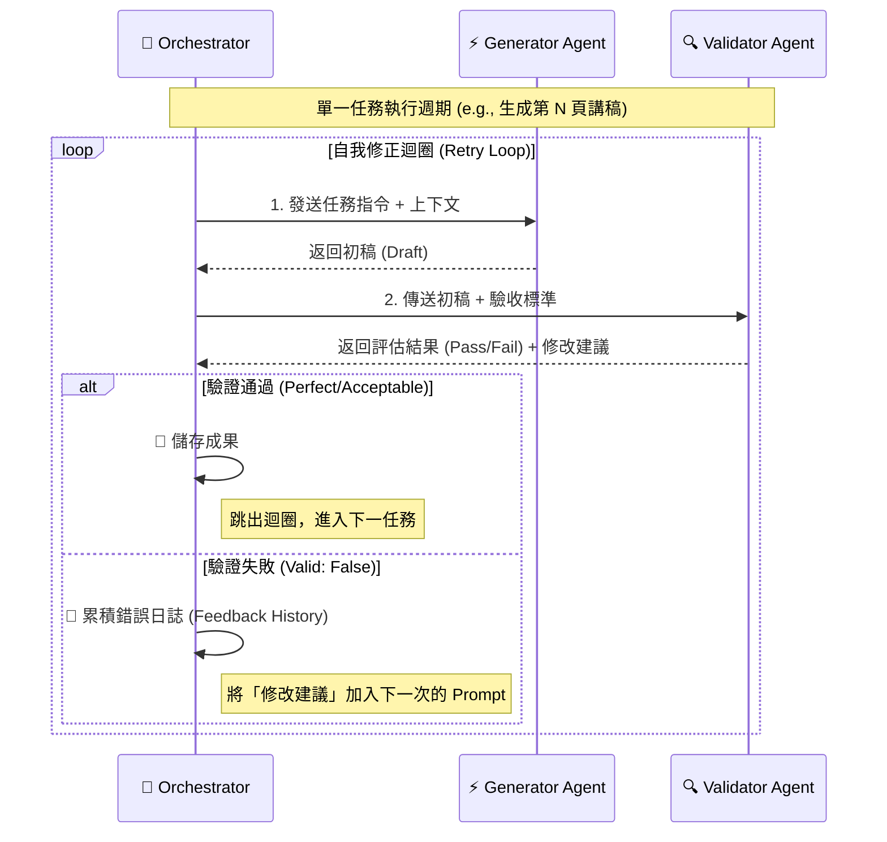

# 🧠 PPTPlaner (AI 簡報學習規劃器)

> **「程式碼是我們對抗時間焦慮的武器。」**  
> 將任何長篇文獻、研究報告自動轉化為結構化的簡報學習方案，包含投影片 (Slides)、深度學習備忘稿 (Notes) 與展示影片。

本專案內建全新的 **零摩擦自動啟動器**。**無論您是第一次用電腦執行程式的新手，還是進階開發者，均不需要手動下載配置任何 Python 依賴套件或虛擬環境！**
首次啟動時，啟動器會自動偵測您的系統，並建立乾淨隔離的 `.venv` 虛擬環境；同時支援最新的 Astral `uv` 超高速安裝引擎，享受秒級的極速啟動體驗！

---

## 🤖 智慧品質審查看板 (AI Auditor Dashboard)

在最新版的 GUI 中，我們特別設計了**智慧品質審查看板 (AI Auditor Dashboard)**，將 AI 的審查與品質控制過程完全視覺化呈現在介面右側，讓使用者可以即時且透明地觀察到 AI 正在對生成的簡報進行哪些品質檢查與重製修正。

以下是新版 GUI 的運行截圖，展示了該品質審查看板的工作狀態：



### 📝 品質審查真實案例 (Real-world Audit Log Example)

在生成簡報的過程中，Validator 品管代理人如果發現瑕疵，會自動給出具體的修改回饋並進行重製。例如：

> **🔍 Validator 審查結果反饋：**
>
> 「整體投影片結構完整、邏輯清晰，頁面間的過渡自然，且完全符合台灣繁體中文的專業語氣。然而，內容中仍有以下微小瑕疵需要修正：
> 1. **投影片 08（組合式節點分組演算法）**：內文中出現「最大交易額 the 設定門檻」，其中「the」為英文單字殘留，應修正為「最大交易額的設定門檻」或「最大交易額之設定門檻」。
> 2. **投影片 16（互動設計與輔助組件需求）**：使用了較偏向大陸習慣的用語「互動設計與輔助組件需求」（組件）及「配合靈活的交互機制」（交互），建議調整為台灣更為通用的「互動設計與輔助元件需求」及「配合靈活的互動機制」，以保持用語一致性。」

透過此 Generator-Validator 的自我修正迴圈，系統會在背景自動將修正意見餵回給 Generator 並重跑該投影片，直到品質完全符合驗收標準，才正式寫入最終檔案，確保每一頁投影片都具備最高水準的品質。

---

## 🚀 快速開始 (新手友善 / 零摩擦一鍵啟動)

### Step 1: 取得專案檔案
您可以選擇使用 Git，也可以完全不依賴 Git：
* **💡 方法 A：不使用 Git (適合全新新手)**
  直接點擊下載連結：[**下載專案 ZIP 壓縮檔**](https://github.com/Chiakai-Chang/PPTPlaner/archive/refs/heads/main.zip)  
  下載完成後，將 ZIP 檔案**解壓縮**到您的電腦中（如桌面或文件資料夾）。
* **🛠️ 方法 B：使用 Git (適合開發者)**
  在終端機中執行以下指令複製專案：
  ```bash
  git clone https://github.com/Chiakai-Chang/PPTPlaner.git
  cd PPTPlaner
  ```

---

### Step 2: 依您的作業系統一鍵啟動
啟動後，PPTPlaner 會**自動完成所有環境偵測、下載安裝缺失套件、完成配置遷移，並自動開啟 premium 的 GUI 圖形化操作介面**！

> [!TIP]
> **🚀 Astral `uv` 支援**：
> 啟動時會自動偵測是否已安裝 Astral `uv` 工具。若未安裝，啟動器會貼心地提供**一鍵自動下載並啟用 uv** 的選項。使用 `uv` 能將專案初始化與套件安裝速度**提升 10 倍以上**！您也可以選擇不安裝並直接改用標準 Python 工具，完全不受影響。

#### 💻 Windows 系統 (Windows 10/11)
在您解壓或 clone 出來的資料夾中，直接 **按兩下 (Double Click) 執行** 以下檔案：
```bash
PPTPlaner.bat
```
*(提示：首次執行時若出現 Windows Defender 防護警告，請點擊「其他資訊」並選擇「仍要執行」即可)*

#### 🍏 macOS 或 🐧 Linux 系統
開啟終端機 (Terminal)，切換到專案目錄後執行以下指令：
```bash
# 1. 賦予啟動腳本執行權限（僅需在首次執行一次）
chmod +x PPTPlaner.sh

# 2. 啟動 PPTPlaner 智慧助手
./PPTPlaner.sh
```

---

### Step 3: 在 GUI 圖形化介面中操作
一鍵啟動成功後，會自動彈出精美且具科技感的 Tkinter 視窗：
1. **全新生成簡報**：選擇「全新生成」模式 -> 點擊瀏覽選取您的 Markdown 原始文獻 (例如 `source/Chapter5.md`) -> 點擊「開始生成」即可。
2. **影片合成 (選用)**：簡報生成完畢後，切換到「影片生成」模式 -> 選擇簡報的輸出資料夾 -> 點擊「開始生成」即可自動合成帶有高品質 AI 配音的 MP4 教學影片。

---

## 🛠️ 開發者進階命令 (CLI 模式)

如果您習慣使用 Command Line 進行開發，可以直接呼叫核心腳本：

```bash
# 1. 啟用簡報與備忘稿生成管線 (Phase 1-5)
python scripts/orchestrate.py --source source/Chapter5.md

# 2. 獨立調用影片合成管線 (Phase 6 - 需要 ffmpeg)
python scripts/video_pipeline.py --project-root . --enable-video

# 3. 獨立調用投影片按數字順序合併工具
python scripts/combine_slides.py output/你的簡報資料夾
```

---

## ✨ 核心功能與品質保證

| 功能 | 說明 | 狀態 |
|------|------|------|
| 📊 **AI 簡報生成** | 自動生成結構化、排版優雅的 Markdown 格式投影片 (Gamma 相容) | ✅ |
| 📝 **深度學習備忘稿** | 基於費曼學習法驅動的逐字講稿生成，保留關鍵學術名詞 | ✅ |
| 🎬 **影片生成** | 一鍵將投影片與備忘稿轉換為精美、動態的 YouTube 教學影片 | ✅ |
| 🎤 **跨平台 TTY Agent** | 支援 Antigravity CLI (agy) 與 PTY 降級，無縫支援 Windows/macOS/Linux | ✅ |
| 🧰 **智慧品管引擎** | 雙代理人 Generator-Validator 品管機制，自動自我糾錯與重試 | ✅ |

---

## 🏗️ 處理管線與核心架報 (Pipeline & Micro Agentic Loop)

### 1. 五階段處理管線 (Macro: The Knowledge Pipeline)
系統將非結構化的原始文獻，透過五個階段的轉換，最終煉成結構化的知識資產。


```mermaid
graph LR
    subgraph Input ["輸入層"]
        Source["📄 原始文獻"]
    end

    subgraph Pipeline ["AI 處理管線"]
        direction TB
        Phase1("🔍 Phase 1: Analysis<br>分析與元數據提取")
        Phase2("🗺️ Phase 2: Planning<br>教學架構規劃")
        Phase3("🎞️ Phase 3: Deck Gen<br>投影片內容生成")
        Phase4("📝 Phase 4: Memo Gen<br>逐字稿撰寫")
        Phase5("🎨 Phase 5: SVG Gen<br>視覺素材生成")
        
        Phase1 --> Phase2 --> Phase3 --> Phase4 --> Phase5
    end

    subgraph Output ["輸出層"]
        Result1["📊 結構化投影片 .md"]
        Result2["🎙️ 講者逐字稿 .md"]
        Result3["🖼️ 動畫圖表 .svg"]
        Result4["🌐 整合網頁 .html"]
    end

    Source --> Phase1
    Phase5 --> Result1 & Result2 & Result3 & Result4
```

### 2. 微觀協作模式 (Micro: The Agentic Loop)
為了確保產出品質，我們不依賴單次 Prompt (Zero-shot)，而是為每個關鍵步驟設計了 **"Generator-Validator-Refiner"** 的自我修正迴圈。

*   **Orchestrator (指揮官)**：負責狀態管理、錯誤處理與流程控制。
*   **Generator (生成者)**：專注於創造力與內容生成的 Agent。
*   **Validator (品管者)**：專注於邏輯檢查、事實查核與格式驗證的 Agent。


```mermaid
sequenceDiagram
    participant O as 🤖 Orchestrator
    participant G as ⚡ Generator Agent
    participant V as 🔍 Validator Agent

    Note over O, V: 單一任務執行週期 (e.g., 生成第 N 頁講稿)
    
    loop 自我修正迴圈 (Retry Loop)
        O->>G: 1. 發送任務指令 + 上下文
        G-->>O: 返回初稿 (Draft)
        
        O->>V: 2. 傳送初稿 + 驗收標準
        V-->>O: 返回評估結果 (Pass/Fail) + 修改建議
        
        alt 驗證通過 (Perfect/Acceptable)
            O->>O: 💾 儲存成果
            Note right of O: 跳出迴圈，進入下一任務
        else 驗證失敗 (Valid: False)
            O->>O: 📝 累積錯誤日誌 (Feedback History)
            Note right of O: 將「修改建議」加入下一次的 Prompt
        end
    end
```

---

## 🛡️ 核心技術亮點 (Technical Highlights)

*   **🛡️ 容錯式編排 (Fault-Tolerant Orchestration)**：
    *   實作了 **State Persistence (狀態持久化)**，即使 API 連線中斷或配額耗盡，系統能自動暫停並保存進度，隨時恢復執行 (Resume)。
*   **🧠 語境注入 (Context Injection)**：
    *   在生成下游內容（如 SVG 圖表）時，系統會自動注入上游的上下文（如投影片大綱、講稿內容），確保視覺圖表與演講內容高度一致。
*   **🔄 累積式反饋 (Cumulative Feedback)**：
    *   在重試迴圈中，系統會維護一份 `feedback_history`，讓 AI 不僅知道「這次錯了」，還知道「過去犯過哪些錯」，避免在修正過程中反覆踏入相同的誤區。
*   **👁️ 透明化品管 (Transparent QA & Audit Logs)**：
    *   系統會在 CLI 介面即時顯示每個階段的驗證結果與重試理由（例如：「內容遺漏」、「格式錯誤」）。
    *   同時，所有的 AI 推理過程（包含原始 Prompt、Raw Response、驗證回饋）都會完整記錄於 `logs/` 資料夾的日誌檔中，提供完整的 **可追溯性 (Traceability)**，讓您隨時可以「查帳」AI 的思考邏輯。

---

## 📊 如何解讀日誌 (How to Read Logs)

當您查看 `logs/` 資料夾中的日誌時，您會看到 AI 與品管系統的互動紀錄：

*   **`✓ ... validation passed (Perfect).`**：表示產出完美符合所有標準，一次過關。
*   **`✓ ... validation passed (Acceptable). Striving for perfection...`**：表示產出雖然可用（如：字數稍多），但 AI 認為還可以更好。系統已暫存此版本，並**主動重試**以追求完美。
*   **`[QA Feedback]: ...`**：這是品管 Agent 發現的具體問題（如：缺少關鍵引文、格式錯誤）。系統會將此回饋傳遞給生成 Agent 進行修正。
*   **`Max retries reached... Using best acceptable result.`**：表示經過多次嘗試仍未達到完美，系統為了不中斷流程，智慧地退回使用之前最好的「可接受」版本。

---

## 📚 文件導航

| 需求 | 文件 | 連結 |
|------|------|------|
| 🚀 系統架構與適配 | 跨平台與 TTY 技術指南 | [CROSS_PLATFORM_SUPPORT.md](docs/CROSS_PLATFORM_SUPPORT.md) |
| 🎬 影片生成技術 | 影片管線總索引 | [VIDEO_PIPELINE_INDEX.md](docs/VIDEO_PIPELINE_INDEX.md) |
| ⚙️ 環境安裝細節 | 影片管線設定指南 | [VIDEO_PIPELINE_SETUP_GUIDE.md](docs/VIDEO_PIPELINE_SETUP_GUIDE.md) |
| 📚 哲學與開發指南 | PPTPlaner 核心哲學 | [GEMINI.md](GEMINI.md) |

---

## 📂 核心檔案清單 (Core Project Files)

若您想分享此專案，以下是確保程式運作所需的最精簡檔案列表：

```
PPTPlaner/
├─ PPTPlaner.bat          # ⭐ Windows 一鍵啟動入口 (虛擬環境自動偵測)
├─ PPTPlaner.sh           # ⭐ macOS/Linux 一鍵啟動入口 (虛擬環境自動偵測)
├─ config.yaml            # 專案基礎設定
├─ requirements.txt       # Python 套件依賴列表
├─ run_ui.py              # 圖形介面主程式
├─ templates/
│  └─ guide.html.j2       # HTML 產生模板
└─ scripts/
   ├─ orchestrate.py      # 核心主控腳本
   └─ build_guide.py      # HTML 產生腳本
```

**您需要提供的：**
*   您自己的原文書或簡報檔案，通常會放在 `source/` 資料夾中 (例如 `source/Chapter5.md`)。

---

## 📊 測試覆蓋 (TDD 驅動)

專案採用嚴格的測試驅動開發 (TDD) 模式，在乾淨的非 Windows 環境下亦能流暢收集並執行所有測試：

```bash
# 執行完整測試套件
pytest
```

Output:
```text
================== 153 passed, 3 skipped in 67.24s (0:01:07) ==================
```

---

## 💡 專案初衷與開發哲學 (The "Why" Behind PPTPlaner)

> **「程式碼不僅是邏輯的堆疊，更是我們對抗資訊焦慮、守護時間的武器。」**
> *Code is not just logic; it is our weapon against the anxiety of time.*

### 1. 緣起：在案件與文獻的夾縫中求生
身處 2025 年的科技偵查、資料分析、AI 研究與開源情資（OSINT）第一線，我們最稀缺的資源永遠是 **「時間」** 。面對日新月異的 ArXiv 論文、突發的技術報告，以及海量的白皮書，我們常陷入「讀與不讀」的兩難。

**PPTPlaner** 誕生於這種生存壓力之下。我們不希望技術學習成為負擔，它應該是**自動、高效且結構化**的。

### 2. 開發哲學：不完美的橋樑，通往完美的知識
我們必須誠實且謙卑地說明：**我們不生產知識，我們致力於成為原著與讀者之間的「橋樑」。**

*   **推崇原著**：PPTPlaner 的產出絕非原著的替代品。我們希望幫助您用 10 分鐘判斷這篇文獻是否值得您花 3 小時深讀。**回到原著，才是獲取真實價值的途徑。**
*   **引用倫理 (Citation Ethics)**：本工具的 Prompt 已被精心設計為「知識導讀者」而非「創作者」。生成的內容會盡力保持客觀並標註來源，但作為使用者，**您有責任確認最終產出的引用是否準確**，並尊重原作者的智慧財產權。
*   **擁抱進化**：這是一個開源專案。如果您覺得生成的內容有瑕疵，感謝您幫我們找出了盲點；如果您有更好的 Prompt 或架構建議，**歡迎發起 Issue 或 PR**。

### 3. 願景：保持尖端戰力的浪漫
正如作者在 DeepRead AI 頻道創立時所言：

> 「希望這個小作品，能在大家忙碌的工作裡，放進一點輕鬆、也放進一點**『保持尖端戰力』的浪漫**。」

無論您是執法夥伴、資安專家還是開發者，歡迎 Fork 這個專案，打造屬於您的知識萃取流水線。讓我們不用再孤軍奮戰，用最省力的方式，一起變強。

---

## ❓ 常見問題

### Q: 出現「找不到 Python」錯誤？
**A:** 請前往 [Python 官網](https://www.python.org/downloads/) 下載並安裝 Python 3.12+，安裝時請務必勾選 **"Add Python to PATH"**。

### Q: 影片生成失敗，提示缺少 FFmpeg？
**A:** 影片渲染需要 FFmpeg：
- **Windows**: 圖形介面會引導您下載，或透過 `winget install Gyan.FFmpeg` 安裝。
- **macOS**: 在終端機執行 `brew install ffmpeg`。
- **Linux**: 在終端機執行 `sudo apt install ffmpeg`。

---

## 📜 授權與作者 (License & Credits)

*   **License**: MIT License. 可自由使用於非商業的教學與研究用途。
*   **Original Creator**: Chiakai Chang
*   **Contact**:
    *   **Email**: [lotifv@gmail.com](mailto:lotifv@gmail.com)
    *   **LinkedIn**: [chiakai-chang-htciu](https://www.linkedin.com/in/chiakai-chang-htciu)
    *   **GitHub**: [Chiakai-Chang](https://github.com/Chiakai-Chang)
*   **Inspiration**: Inspired by the need to prepare for the *Eyewitness Memory* chapter in a Forensic Psychology course at Central Police University.

---

## 🙏 致謝

感謝以下開源專案的貢獻：
- [Edge-TTS](https://github.com/rany2/edge-tts) — 高品質語音合成
- [Pillow](https://github.com/python-pillow/Pillow) — 圖形介面與圖像生成
- [Jinja2](https://github.com/pallets/jinja) — 範本化引擎
- [pytest](https://github.com/pytest-dev/pytest) — 測試框架
