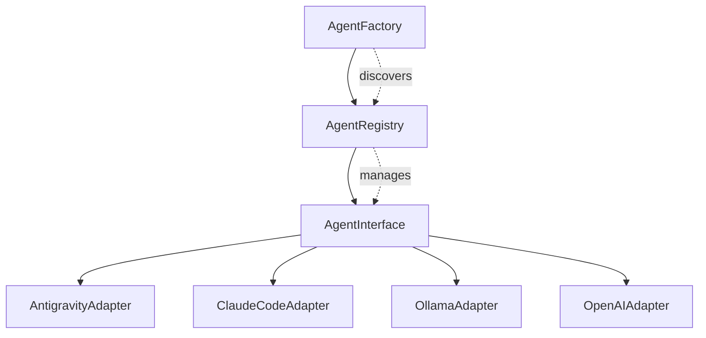
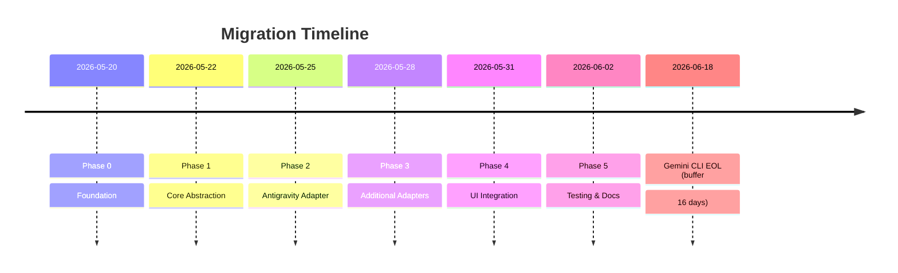

# Agent Migration Task Plan

> **Project**: PPTPlaner Multi-Agent Architecture Migration
> **Deadline**: June 18, 2026 (Gemini CLI EOL)
> **Methodology**: SDD + BDD + TDD
> **Status**: Planning Phase

---

## 📋 Table of Contents

- [Phase 0: Foundation & Infrastructure](#phase-0-foundation--infrastructure)
- [Phase 1: Core Agent Abstraction](#phase-1-core-agent-abstraction)
- [Phase 2: Antigravity CLI Adapter](#phase-2-antigravity-cli-adapter)
- [Phase 3: Additional Agent Adapters](#phase-3-additional-agent-adapters)
- [Phase 4: UI Integration](#phase-4-ui-integration)
- [Phase 5: Testing & Documentation](#phase-5-testing--documentation)

---

## 🎯 Success Criteria

| Metric | Target | Verification |
|--------|--------|--------------|
| Agent Support | 5+ backends | Unit tests + integration tests |
| Migration Time | < 2 weeks | Timeline tracking |
| Test Coverage | 80%+ | Coverage reports |
| Zero Downtime | Seamless switch | User testing |
| Backward Compatibility | Full | Regression tests |

---

## Phase 0: Foundation & Infrastructure

### 📖 Recipe Overview

**目標**: 建立專案基礎設施，包括目錄結構、測試框架、CI/CD

**時間**: 1-2 days

**食材 (Dependencies)**:
- Python 3.12+
- pytest, pytest-cov
- mypy (type checking)
- pre-commit hooks

### 📋 Task Queue

```yaml
task_id: 000
status: pending
type: infrastructure

## Ingredients
- pytest>=7.0
- pytest-cov>=4.0
- mypy>=1.0
- pre-commit>=3.0

## Recipe Steps
1. [ ] Create `tests/` directory structure
2. [ ] Create `agents/` module directory
3. [ ] Setup `pytest.ini` configuration
4. [ ] Setup `mypy.ini` type checking
5. [ ] Create `pre-commit` hooks
6. [ ] Add `.coveragerc` configuration
7. [ ] Create `tox.ini` for multi-version testing

## Verification
- [ ] `pytest --collect-only` shows test structure
- [ ] `mypy --version` available
- [ ] Pre-commit hooks configured
```

### 🧪 Test Specifications (TDD)

```python
# tests/conftest.py - Fixtures for agent testing
@pytest.fixture
def mock_subprocess():
    """Mock subprocess.run for agent testing"""
    pass

@pytest.fixture  
def agent_config():
    """Sample agent configuration"""
    return {
        "agent": "test",
        "model": "test-model",
        "api_key": "test-key"
    }
```

---

## Phase 1: Core Agent Abstraction

### 📖 Recipe Overview

**目標**: 建立 Agent 抽象層，定義通用介面與註冊機制

**時間**: 2-3 days

**食材 (Dependencies)**:
- Phase 0 completed
- ABC (Abstract Base Classes)
- typing.Protocol for duck typing

### 📋 Task Queue

```yaml
task_id: 001
status: pending
type: implementation

## Ingredients
- Python ABC module
- typing module (Protocol, Generic)
- logging module

## Recipe Steps
1. [ ] Create `agents/__init__.py`
2. [ ] Create `agents/base.py` - AgentInterface ABC
3. [ ] Create `agents/registry.py` - AgentRegistry singleton
4. [ ] Create `agents/factory.py` - AgentFactory
5. [ ] Create `agents/exceptions.py` - Custom exceptions
6. [ ] Implement unit tests for each component

## Acceptance Criteria (BDD)

Scenario: Register a new agent
  Given the agent registry is initialized
  When I register an agent with name "test"
  Then I can retrieve the agent by name
  And the agent count increases by 1

Scenario: Create agent from config
  Given an agent config with valid agent name
  When I call AgentFactory.create()
  Then it returns an instance of the correct agent class
  And the agent is properly configured
```

### 🏗️ System Design (SDD)



### 🧪 Test Specifications (TDD)

```python
# tests/agents/test_base.py

class TestAgentInterface:
    """Test the base agent interface"""
    
    def test_cannot_instantiate_abstract(self):
        with pytest.raises(TypeError):
            AgentInterface()  # Should fail - abstract
    
    def test_must_implement_execute(self):
        class ConcreteAgent(AgentInterface):
            def execute(self, *args, **kwargs): return ""
            def get_models(self): return []
            def is_available(self): return True
            
        agent = ConcreteAgent({})
        assert agent.is_available() == True

# tests/agents/test_registry.py

class TestAgentRegistry:
    def test_register_agent(self):
        registry = AgentRegistry()
        registry.register("test", TestAgent)
        assert "test" in registry.available_agents
        
    def test_get_agent_class(self):
        registry = AgentRegistry()
        registry.register("test", TestAgent)
        agent_class = registry.get_agent_class("test")
        assert agent_class == TestAgent
        
    def test_list_available_agents(self):
        registry = AgentRegistry()
        registry.register("agent1", TestAgent)
        registry.register("agent2", TestAgent)
        assert len(registry.list_agents()) == 2
```

---

## Phase 2: Antigravity CLI Adapter

### 📖 Recipe Overview

**目標**: 實作 Antigravity CLI 適配器，確保基本功能運作

**時間**: 2-3 days

**食材 (Dependencies)**:
- Phase 1 completed
- Antigravity CLI installed (`agy` command)
- subprocess module
- Platform detection logic

### 📋 Task Queue

```yaml
task_id: 010
status: pending
blocked_by: [001]
type: implementation

## Ingredients
- agy CLI installed
- subprocess module
- shlex module

## Recipe Steps
1. [ ] Create `agents/antigravity.py`
2. [ ] Implement command construction
3. [ ] Implement model listing
4. [ ] Implement availability check
5. [ ] Implement error handling
6. [ ] Add integration tests

## Command Mapping

| Operation | Gemini CLI | Antigravity CLI |
|-----------|------------|-----------------|
| Execute | `gemini "prompt"` | `agy "prompt"` |
| Model | `gemini -m model` | `agy -m model` |
| JSON | `--output-format json` | `--output-format json` |
```

### 🧪 Test Specifications (TDD)

```python
# tests/agents/test_antigravity.py

class TestAntigravityAdapter:
    
    @pytest.mark.integration
    def test_is_available_when_installed(self):
        adapter = AntigravityAdapter({})
        # Should detect agy in PATH
        assert adapter.is_available() == True
        
    @pytest.mark.integration  
    def test_execute_returns_output(self):
        adapter = AntigravityAdapter({})
        result = adapter.execute("Say hello", "test")
        assert isinstance(result, str)
        assert len(result) > 0
        
    @pytest.mark.parametrize("mode", ["PLAN", "DECK", "MEMO"])
    def test_different_modes(self, mode):
        adapter = AntigravityAdapter({})
        result = adapter.execute("test prompt", mode)
        assert result is not None
```

---

## Phase 3: Additional Agent Adapters

### 📖 Recipe Overview

**目標**: 實作其他 Agent 適配器（Claude Code、Ollama、OpenAI）

**時間**: 3-5 days

**食材 (Dependencies)**:
- Phase 2 completed
- Claude Code CLI / OpenAI API / Ollama

### 📋 Task Queue

```yaml
task_id: 020
status: pending
blocked_by: [010]
type: implementation

## Recipe Steps
1. [ ] Create `agents/claude.py`
2. [ ] Create `agents/ollama.py`
3. [ ] Create `agents/openai.py`
4. [ ] Create `agents/codex.py`
5. [ ] Update `agents/__init__.py` to import all
6. [ ] Add adapter-specific tests
```

---

## Phase 4: UI Integration

### 📖 Recipe Overview

**目標**: 在 UI 中整合 Agent 選擇功能

**時間**: 2-3 days

### 📋 Task Queue

```yaml
task_id: 030
status: pending
blocked_by: [020]
type: ui_integration

## Recipe Steps
1. [ ] Update `run_ui.py` to show agent selector
2. [ ] Add agent availability indicators
3. [ ] Add model selector per agent
4. [ ] Update orchestration call to use agent
5. [ ] Update configuration saving/loading
6. [ ] Add UI tests with tkinter testing
```

---

## Phase 5: Testing & Documentation

### 📖 Recipe Overview

**目標**: 完成測試覆蓋率與文件更新

**時間**: 2 days

### 📋 Task Queue

```yaml
task_id: 040
status: pending
blocked_by: [030]
type: documentation

## Recipe Steps
1. [ ] Update README.md with agent options
2. [ ] Update config.yaml documentation
3. [ ] Add migration guide for users
4. [ ] Run full test suite
5. [ ] Generate coverage report
6. [ ] Create demo videos
```

---

## 🔄 Commit Strategy

| Phase | Commit Message Pattern |
|-------|----------------------|
| Phase 0 | `chore: setup testing infrastructure` |
| Phase 1 | `feat: add agent abstraction layer` |
| Phase 2 | `feat: add antigravity cli adapter` |
| Phase 3 | `feat: add claude/ollama/openai adapters` |
| Phase 4 | `feat: integrate agent selector in UI` |
| Phase 5 | `docs: update documentation for multi-agent` |

---

## 🚀 Rollout Plan



---

## 📝 Notes

- Each phase should be committed separately
- Run full test suite before merging
- Update this document as progress is made
- Use `git tag` for version milestones
