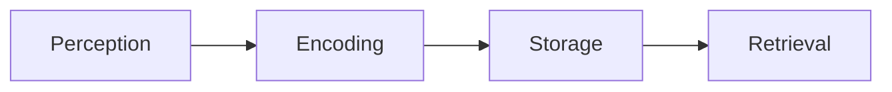

# 使用教學指南（USAGE_zh-TW）

> 適用對象：警察大學、警政機關或研究單位中，需要將章節／報告／逐字稿快速轉成簡報與逐頁講稿的使用者。  
> 本指南以 **Windows** 環境為主，支援 **Antigravity CLI / Claude Code / OpenAI-compatible API**。

[← 返回主頁（README.md）](../README.md)  
[→ Agent 遷移計畫（AGENT_MIGRATION_PLAN.md）](./AGENT_MIGRATION_PLAN.md)

---

## 一、前言：為什麼需要這套系統？

在教學、報告或司法研究中，我們常有這樣的需求：
> 「我有一份長文（章節、報告、逐字稿），想快速整理成可投影片講解的形式，並且每一頁都能對應一份精緻講稿。」

本專案透過 **agents/ + orchestrate.py + config.yaml**，自動將原始文本轉換為：
- **slides/**：Markdown 投影片（可直接貼入 Gamma 或 PowerPoint）
- **notes/**：逐頁備忘稿（繁體中文＋英文術語）
- **指引.html**：可搜尋、可複製、可展示的對照頁

整個過程幾乎不需人工操作，**輸入原始檔 → 一鍵生成**。

---

## 二、安裝與環境準備（Windows）

### 1️⃣ 安裝 Python（3.10 以上）

- 進入 [Python 官網](https://www.python.org/downloads/)
- 勾選 **Add Python to PATH**
- 確認版本：
  ```powershell
  python --version
  ```

### 2️⃣ 安裝必要套件

```powershell
pip install pyyaml jinja2 markdown-it-py requests
```

若你的機關電腦無法直接安裝，可改用離線封包方式。

### 3️⃣ 選擇 AI Agent

PPTPlaner 支援多種 AI Agent 後端，您可以根據需求選擇：

#### 🟢 選項 A：Antigravity CLI（推薦，預設）

Google Antigravity CLI 是 Gemini CLI 的繼承者，提供免費配額。

```powershell
npm install -g @google/antigravity-cli
agy --help  # 確認安裝成功
```

#### 🔵 選項 B：Claude Code CLI

Anthropic 的 CLI 工具，需建立 API Key。

```powershell
npm install -g @anthropic-ai/claude-code
claude --version  # 確認安裝成功
```

#### 🟣 選項 C：OpenAI-compatible API（本地模型）

適合想要本地執行或已有 API Key 的使用者。

**方式 1：使用 Ollama（免費）**

```powershell
# 1. 下載 Ollama：https://ollama.ai/
# 2. 拉取模型
ollama pull llama3.1
# 3. 確認 API 端點
curl http://localhost:11434/api/tags
```

**方式 2：使用 llama.cpp server**

```powershell
# 1. 下載 llama.cpp：https://github.com/ggerganov/llama.cpp
# 2. 啟動 server
llama-server -m your-model.gguf -c 4096 --port 8080
# 3. 確認 API 端點
curl http://localhost:8080/props
```

#### 🟠 選項 D：OpenAI Direct API

直接使用 OpenAI 官方 API（需付費）。

在 `config.yaml` 中設定：
```yaml
agent: "openai"
agent_config:
  api_key: "sk-..."  # 您的 API Key
  model: "gpt-4o"
```

---

## 三、建立任務設定檔（config.yaml）

此檔控制整個轉換流程，你只需修改這一份。

### 範例：

```yaml
source_file: "Chapter5.md"
agent: "antigravity"  # 支援: antigravity, claude, openai-compatible, openai

# Agent 特定設定
agent_config:
  model: null           # 特定模型（可選）
  api_base: null        # OpenAI-compatible API 端點
  api_key: null         # API Key（需要時）

notes_locale: "zh-TW"
preserve_english_terms: true

split_strategy: "semantic"
max_pages_per_file: 10
memo_per_page: true
memo_target_time_min: 2
memo_target_time_max: 3

slides_dir: "slides"
notes_dir: "notes"
diagrams_dir: "diagrams"
guide_file: "指引.html"

slides_naming: "slides/{page}_{topic}.md"
notes_naming:  "notes/note-{page}_{topic}-zh.md"

build_guide: true
auto_open_guide: true

validate_alignment: true
validate_keywords: true
validate_time_estimate: true

dual_language: false
zip_output: true
zip_name: "PPTPlaner_Package.zip"

tone: "academic-friendly"

# AI 品管設定
slide_max_reworks: 5
memo_max_reworks: 5
plan_max_reworks: 6
agent_execution_retries: 3
```

### 🔍 OpenAI-compatible 設定範例

**Ollama 設定**：
```yaml
agent: "openai-compatible"
agent_config:
  api_base: "http://localhost:11434/v1"
  model: "llama3.1"
```

**llama.cpp 設定**：
```yaml
agent: "openai-compatible"
agent_config:
  api_base: "http://localhost:8080/v1"
  model: null  # 自動偵測
```

---

## 四、主要工作流程（Step-by-Step）

### 方式 1：使用圖形介面（推薦）

1. **執行 `START_HERE.bat`**
2. **選擇操作模式**：全新生成 / 接續生成 SVG / 製作圖文簡報
3. **選擇 AI Agent**：
   - 選擇 `antigravity`（推薦）或 `claude`
   - 或選擇 `openai-compatible` 並點擊「偵測」按鈕自動發現本地模型
4. **設定 API 端點**（僅 openai-compatible 需要）
   - Ollama：`http://localhost:11434/v1`
   - llama.cpp：`http://localhost:8080/v1`
5. **填入原文書檔案**後點擊「開始生成」

### 方式 2：使用命令列

| 階段  | 模式          | 輸出       | 說明                 |
| --- | ----------- | -------- | ------------------ |
| 1️⃣ | PLAN        | JSON     | 切頁規劃（從章節到 10 頁內主題） |
| 2️⃣ | SLIDE       | Markdown | 每頁一段簡報重點           |
| 3️⃣ | MEMO        | 純文字      | 每頁一段繁中備忘稿（含英文原文）   |
| 4️⃣ | VALIDATE    | Log      | 對齊、時間、術語檢查         |
| 5️⃣ | BUILD_GUIDE | HTML     | 生成「指引.html」一頁總覽    |

**執行命令：**

```bash
python scripts/orchestrate.py
```

完成後會自動打開指引頁，可直接搜尋並複製每頁講稿。

---

## 五、逐頁備忘稿原則（Page-by-Page Memo）

每頁講稿皆由 AI 自動生成，但會遵循下列規範：

| 區段              | 說明               | 時間建議    |
| --------------- | ---------------- | ------- |
| **Slide Recap** | 概述此頁重點（英中並列）     | 15–20 秒 |
| **核心概念與研究**     | 引述經典實驗、理論（含英文原文） | 約 1 分鐘  |
| **法律或實務應用**     | 加入臺灣脈絡（訪談、列隊、法院） | 約 1 分鐘  |
| **轉場句**         | 承接下一頁            | 10–15 秒 |

### ✍️ 範例（由系統自動生成）

```
本頁說明 *Signal Detection Theory*（訊號偵測理論），強調辨識決策的「準確性」與「標準」是兩個獨立維度。
實驗顯示，證人可能因內在信心過高而降低標準，導致誤認。這不代表記憶好，而是決策門檻低。
實務上，我們可透過訓練調整受試者的判斷準則，減少高信心誤認。
下一頁將介紹這些誤差如何影響陪審團的信任度。
```

---

## 六、Agent 設定速查表

| Agent | 設定檔設定 | 備註 |
|-------|----------|------|
| **Antigravity** | `agent: "antigravity"` | 預設選項，免設定 |
| **Claude Code** | `agent: "claude"` | 需安裝 CLI |
| **OpenAI-compatible** | `agent: "openai-compatible"` | 需設定 api_base |
| **OpenAI API** | `agent: "openai"` | 需設定 api_key |

## 七、智慧模型偵測功能

當選擇 **openai-compatible** Agent 時，系統提供「偵測」按鈕自動發現本地模型：

```plaintext
偵測結果：
找到 ollama 於 http://localhost:11434/v1
可用模型: llama3.1, mistral, phi3
```

**偵測的端點**：
- Ollama：`http://localhost:11434` 或 `http://127.0.0.1:11434`
- llama.cpp：`http://localhost:8080` 或 `http://127.0.0.1:8080`

**手動設定**：
若自動偵測失敗，您可手動輸入 API 端點 URL。

---

## 七、常見問題（FAQ）

**Q：中文路徑或檔名會壞掉嗎？**
A：不會，已測試 Windows 路徑；若遇亂碼，可先將 `config.yaml` 改成 UTF-8。

**Q：為什麼 slides 和 notes 數量不同？**
A：可能某頁解析失敗。執行 `python scripts/validate.py` 可檢查未對應頁。

**Q：要怎麼重新生成特定頁？**
A：手動執行該頁的 `SLIDE` 或 `MEMO` 模式即可。

**Q：我不想開指引頁？**
A：把 `auto_open_guide: false` 即可。

**Q：指引頁出現亂碼？**
A：檢查 `Jinja2` 是否安裝；若無會使用備援模板。

**Q：如何切換 AI Agent？**
A：在 UI 中的 "AI Agent" 下拉選單選擇，或修改 `config.yaml` 的 `agent` 欄位。

**Q：使用本地模型（Ollama/llama.cpp）需要網路嗎？**
A：不需要，模型完全在本地執行。

**Q：本地模型偵測不到怎麼辦？**
A：
1. 確認服務正在執行（例如 Ollama 已啟動）
2. 檢查防火牆設定
3. 手動輸入 API 端點 URL

---

## 八、進階應用

### 1️⃣ 雙語講稿

在 `config.yaml` 設定：

```yaml
dual_language: true
```

會額外產出英文講稿（`-en.md`）。

### 2️⃣ Mermaid 圖

在任一 slide 加入：

````

````

會自動匯出到 `diagrams/*.mmd`。

### 3️⃣ 多 Agent 比對

同一頁可分別使用 Codex / Gemini / Claude 產出不同版本的講稿，人工挑選最佳。

---

## 九、教學建議

### 🎓 給老師

* 每週章節可直接丟入 `source_file`，自動生成簡報與講稿。
* 使用 `指引.html` 搜尋頁碼快速備課。
* 可讓學生練習「人工審核」AI 備忘稿。

### 👩‍🎓 給學生

* 可練習整理報告、研討會章節、法庭逐字稿。
* 建議在 MEMO 生成後加上「個人見解段」。
* 若不確定用詞，可用 `dual_language: true` 同時產出中英稿。

---

## 🔟 鳴謝與授權

* 本系統靈感源於中央警察大學法心理學課程「Eyewitness Memory」章節製作需求。
* 特別感謝使用者 Chang, Chia-Kai 於設計時提供結構化規格與逐頁學習流程。
* 內容與產出可自由使用於非商業教學與研究用途。

---

> 💡 提示：
> 若你是第一次使用，請先從 `README.md` 的「快速開始」執行一次完整流程；
> 然後開啟 `指引.html` 熟悉結構後，再逐頁微調每份 MEMO。

---

**文件版本**：v2.0
**最後更新**：2026-05-20
**聯絡人**：[lotifv@gmail.com](mailto:lotifv@gmail.com)（Chang, Chia-Kai）

**更新記錄**：
- v2.0：支援多 Agent 後端、智慧模型偵測、OpenAI-compatible API
- v1.0：初始版本（Codex CLI / Gemini CLI / Claude Code）


